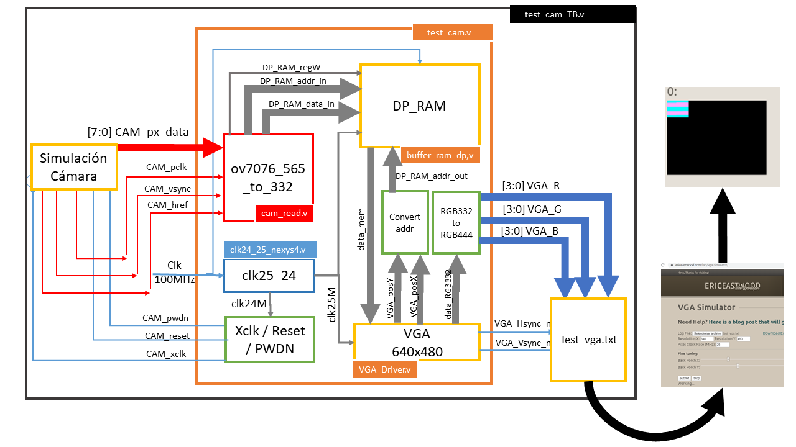

## ELECTRÓNICA DIGITAL 1 2019 -2 UNIVERSIDAD NACIONAL DE COLOMBIA 
## TRABAJO 03- Simulaciòn de HDL para la cámara OV7670

## Introducción 
Este paquete de trabajo incluye  el testbench de bloque de captara de daos de la camara en el formato RGB 565 y genrar un archivo de texto plano que contiene los datos de salida de la pantalla VGA, para su posterio simulaciòn

Se propone el siguiente esquema de trabajo, donde el estudiante puede testear el funcionamiento del driver de la cámara diseñado y visualizar la salida  en el simulador VGA [link](https://ericeastwood.com/lab/vga-simulator/) 

En este paquete de trabajo los estudiantes deben probar el diseño de captura de la camara "cam_read.v" en la configiración RGB565. del paquete de trabajo 02.

Luego de tener el diseño "cam_read.v" deben integrar el bloque HDL en el test_cam.v. y simular la funcionalidad del diseño. Para ello, debe analizar el proyecto propuesto **test_cam.xise del WP03** junto con el siguiente figura:

Como se observa en la figura anterior, el bloque en rojo indican que el grupo de trabajo deben adicionar dicha información al proyecto **test_cam.xise** para completar el funcionamiento.

Para este paquete de trabajo, el estudiante deben estar inscrito en un grupo y copiar la información del siguiente link [WP03](https://classroom.github.com/g/fTcztVJQgg) .
Debe escribir la documentación en el archivo README.md de la carpeta docs. Recuerde, esta documentación debe ser tal que, cualquier compañero de futuros semestres comprenda sus anotaciones y la relación con los módulos diseñados.

***Recuerde: Revisar las instrucciones dadas en metodología y documentación.***

## Material 

Para este paquete de trabajo se debe contar con:

* Plantilla del proyecto sugerido [WP03](https://classroom.github.com/g/fTcztVJQgg) .
* testbench test_cam_TB.v (dado por el profesor)
* Datasheet de la cámara OV7670.
* HDL cam_read.v  diseñado por el grupo
* Simulador-VGA [link](https://ericeastwood.com/lab/vga-simulator/) 

## Desarrollo

Como se ha explicado en la reuniòn, este paquete de trabajo es similar al paquete de trabajo 02. La diferencia radica en un entorno de simulación completo de la càmara y la pantalla VGA.

A la plantilla de proyecto se adicionan los siguientes archivos:
1. ***cam_read.v*** fichero que contiene la declaraciòn de la caja negra, con las respectivas entradas  y salidas. Este archivo debe se utilizado para realiza la descripción funcional de la captura de datos de la camara en formato RGB565
2. ***test_cam_TB.v*** fichero que contiene la simulación de las señales  de la camara y almacena la salida VGA en un archivo de texto plano.  

***RECUEDE: Es necesario documentar el módulo diseñado con los respectivos diagramas funcionales y estructurales y registrar la información en README.md ***

Una vez clone el repositorio, en su computador de la plantilla del proyecto [WP03](https://classroom.github.com/g/fTcztVJQddd), realizar lo siguiente: 

1. Cargar el proyecto en el entorno ISE y  analizar el archivo ***test_cam_TB.v***.
2. En las propiedades de simulaciòn modificar el tiempo de simulación a 30ms. y generar la simulaciòn
3. Una vez terminada la simulaciòn revisar dentro del directorio `HW` que contenga el fichero ***test_vga.txt***
4. ingresar a la web [vga-simulator](https://ericeastwood.com/lab/vga-simulator/)  y cargar el archivo ***test_vga.txt***, dejar los datos de configuraciòn tal cual como aparecen. 
5. ejecutar `submit`. 
6. Compruebe que el resultado en la web es la siguiente imagen

***Nota:*** Observe que en esta instancia usted no ha modificado el hardware del proyecto. y por lo tanto, lo que observa, es la visualizaciòn en la pantalla VGA simulada, es la imagen almacenada en memoria por defecto.

7. Una vez, tenga listo el anterior entorno de trabajo, debe proceder a  modificar el fichero  ***cam_read.v***. Solamnte en este módulo debe trabajar  y describir el funcionamiento de la adquiciòn de los datos de la cámara. 

8. Al terminar de decribir la adquisión de la cámara  repita los paso del 2 a 6.  Si el resultado es el que se observa en la imagen siguiente, indica que el módulo cam_read es adecuada  y por lo tanto, se dara pr terminado este paquete de trabajo, de lo contrario  vuelta al punto 7

la imagen muestra que se adquirio una  foto de color rojo.

***RECUEDE: Es necesario documentar la implementación y registrar la información en README.md, lo puede hacer con ayuda de imágenes o videos***

